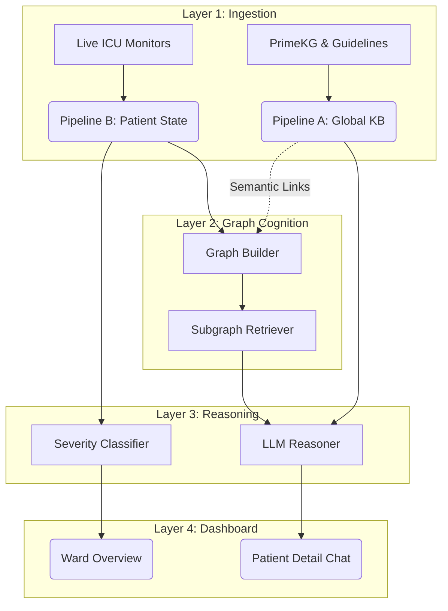

# ICU Copilot Execution Flow (Backend Pipeline Architecture)

This document maps the conceptual backend execution flow and data lifecycle for the ICU Clinical Copilot. The architecture is cleanly divided into static knowledge ingestion, dynamic state ingestion, graph generation, and clinical reasoning.

## The 4-Layer Conceptual Pipeline

### 1. Ingestion Layer (Pipeline A & B)
Data ingestion is split into two asynchronous streams: Static Truth and Dynamic State.

- **Pipeline A: Global Medical Truth (Static/Slow)**
  - `guideline_indexer.py`: Parses and chunks clinical PDFs (like KDIGO for AKI, ADA for Diabetes) and creates a FAISS vector index.
  - `primekg_loader.py`: Loads and parses the massive Harvard PrimeKG dataset into a unified medical knowledge graph.
  - `global_kb_retriever.py`: Exposes a unified API querying both the FAISS guidelines and PrimeKG simultaneously. This acts as the unchangeable "textbook" memory for the AI.

- **Pipeline B: Patient State Ingestion (Dynamic/Fast)**
  - `patient_generator.py`: Generates, parses, and provides the rapid time-series data for ICU patients. This handles demographics, live vitals, labs, active conditions, and administered medications.

### 2. Graph Cognition Layer (Layer 2)
This layer maps raw patient data onto a structured local semantic graph, linking the dynamic state to the static medical truth.

- `graph_builder.py`: Takes the raw JSON/Dict from Pipeline B and translates it into a deterministic NetworkX DiGraph. Every lab result, vital threshold, and medication is represented as a node mapped explicitly to the patient.
- `subgraph_retriever.py`: Given a clinical question, this extracts the *relevant* subgraph surrounding the patient (ignoring irrelevant historical noise) to feed into the LLM context window.

### 3. Reasoning & Triage Layer (Layer 3)
The intelligence layer applies logic to the graphs created in Layer 2. It uses a dual-engine approach (Deterministic + Generative).

- **Deterministic Triage:**
  - `severity_classifier.py`: Runs highly optimized, hard-coded clinical rules (e.g., MAP < 65 = CRITICAL) against the Pipeline B data. Guarantees 100% reliable baseline triage without hallucination risks.

- **Generative Inference (AI):**
  - `model_loader.py`: Safely manages GGUF LLM weights in memory (e.g., MedGemma-4b, Gemma-4-E4B).
  - `reasoner.py`: The orchestrator that takes the deterministic severity flags, the patient subgraph from Layer 2, and the medical truths from Pipeline A, feeding them into the LLM to generate narrative explanations and clinical insights.

### 4. Presentation Layer (Layer 4)
- **Dashboard (`src/dashboard/app.py`)**: The Streamlit user interface that pulls the pre-computed severity scores from Layer 3 for the Ward Overview, and invokes the generative `reasoner.py` and `subgraph_retriever.py` dynamically when the clinician requests an AI explanation in the Patient Detail view.

## Data Execution Lifecycle

## AI Agent Notes
- **Do not mix domains:** Never place patient logic in `pipeline_a`, and never place medical truth parsing in `pipeline_b`.
- **Reasoning isolation:** The LLM (`layer3`) should never query databases directly; it should only receive isolated subgraphs from `layer2` and `pipeline_a`.
