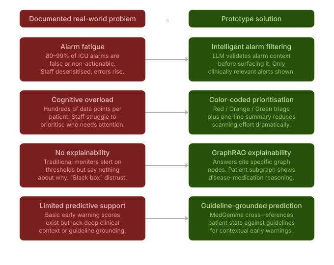
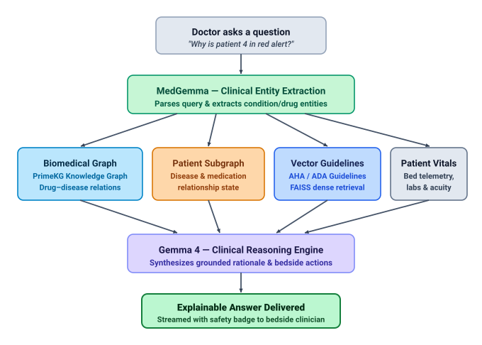
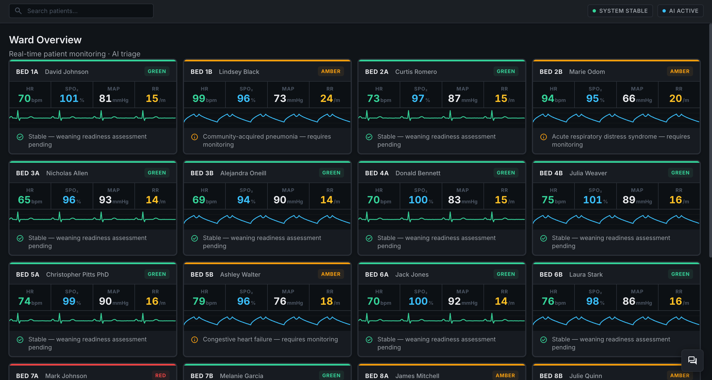
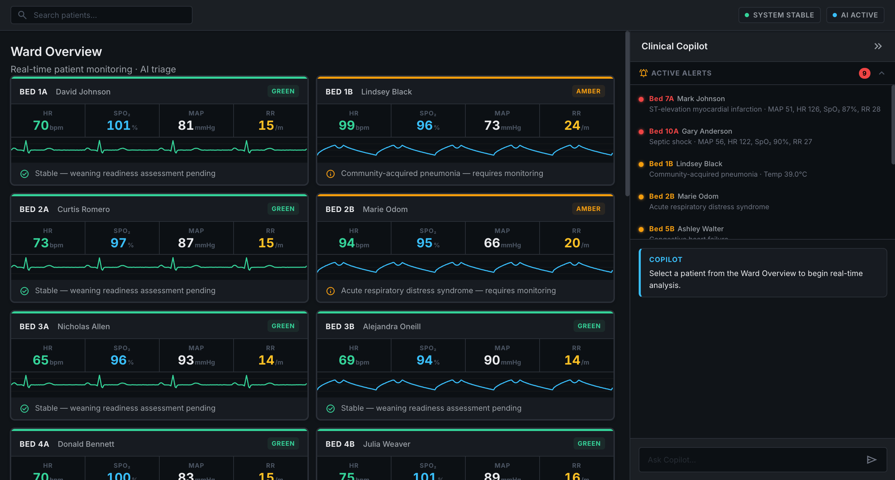
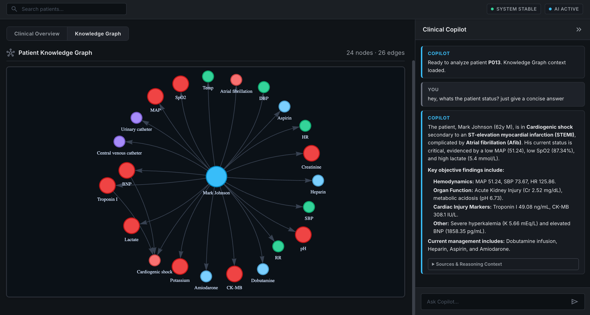
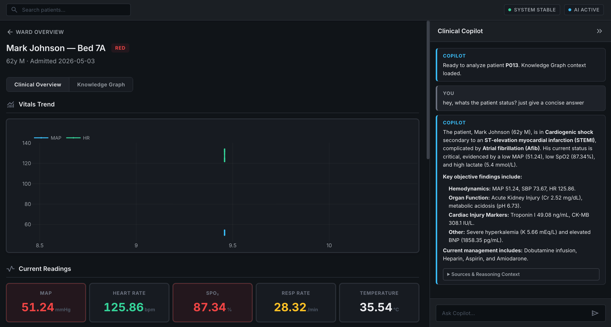

# On-Premise ICU AI Assistant — GraphRAG + LLM Clinical Reasoning 🏥

A locally hosted clinical question-answering system for ICU decision support — no internet, no external API calls, everything runs on your machine.

---

## Why I built this

ICUs are genuinely overwhelming. Nurses and doctors are juggling hundreds of data points per patient, across a dozen beds, with alarms going off constantly (80–99% of which are non-actionable). Meanwhile, the tools they have either drown them in numbers or give zero explanation for why a threshold was crossed.

I got curious: what if you could just *ask* the system a question — "why is bed 4 in red alert?" (or even more complex questions) — and get a grounded, **explainable** answer, **cited against actual clinical guidelines**? This is my attempt at building that, completely offline ensuring **privacy & security**.

---

## How it works

A clinical query flows through two specialized local models and a four-stream retrieval architecture:

1. **MedGemma** (Input Entity Extraction) — parses the clinician's query and extracts candidate medications and conditions
2. **Four-Stream Parallel Retrieval**:
   - **Biomedical Graph (GraphRAG)** — Harvard PrimeKG traversal for verified drug–disease contraindications and interactions
   - **Patient Subgraph** — per-patient disease/medication relationship graph built from active patient telemetry
   - **Vector Guidelines (Dense RAG)** — FAISS semantic vector search over AHA / ADA / Sepsis clinical guidelines
   - **Patient Telemetry & Labs** — real-time vitals, continuous bedside telemetry, and lab profiles
3. **Deterministic Safety Interlock** — checks high-acuity contraindications and knowledge graph edges in <50ms
4. **Gemma 4** (Output Clinical Reasoning) — synthesizes grounded medical explanations, guideline citations, and bedside action plans streamed in real time ✨

---

## What it looks like

**Ward overview — real-time triage across all beds:**

**Drilling into a critical patient with vitals trend:**

**Knowledge graph built from patient data:**

**Clinical Copilot answering a query with structured reasoning:**

---

## Tech stack

| Layer | What's in use |
|---|---|
| LLMs | Gemma 4 4B, MedGemma 4B (via `llama-cpp-python`) |
| Vector search | FAISS + `sentence-transformers` |
| Knowledge graph | PrimeKG via NetworkX, PyVis for rendering |
| RAG orchestration | LangChain |
| Backend | FastAPI + Uvicorn |
| Frontend | Vanilla HTML/CSS/JS |
| Data | Synthetic patient records via synthea |

Everything is local. No cloud dependencies, no PHI leaving the machine. 🔒

---

## Current status

Work in progress. Honestly...

- ✅ Frontend UI (ward overview, patient view, knowledge graph, copilot panel)
- ✅ FAISS vector store over clinical guidelines — working
- ✅ Patient subgraph generation from synthetic records — working
- ✅ FastAPI backend wiring it all together — working
- 🚧 PrimeKG GraphRAG retrieval — currently being debugged (graph traversal returning inconsistent results on some query types)
- 🚧 MedGemma answer synthesis — responses are coherent but citation quality is inconsistent

---

## What's next

A few things I still need to figure out:

- **Fix the KG retrieval** — the graph traversal logic needs better subgraph scoping; right now it sometimes pulls in too many loosely related nodes
- **Evaluation** — I have no formal way to measure answer quality yet; need to build even a basic benchmark against known clinical cases
- **Better prompt engineering** — MedGemma's responses vary a lot depending on how context is chunked and ordered; want to experiment with reranking before injection
- **Real data pathway** — the whole thing runs on synthetic data; connecting to an actual FHIR endpoint is the obvious next step but out of scope for now

This is a hobby project built to explore what on-premise clinical AI could look like. Not for clinical use. 🧪
